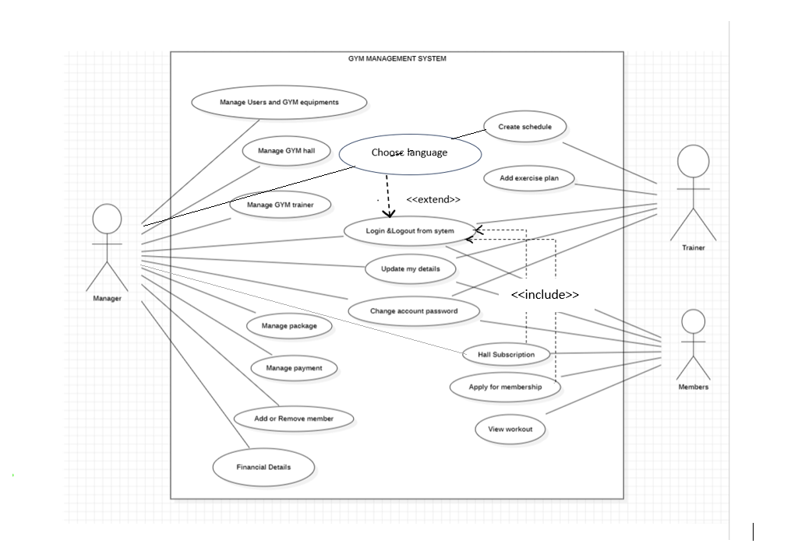

# Gym Management System

A Java Swing desktop application for managing gym members, trainers, plans, equipment, and payments.  
This project demonstrates object-oriented design, GUI development, and modular structuring using Maven.

---

## Overview

The Gym Management System provides a simple interface for both users and administrators.  
It includes modules for member management, trainer assignment, scheduling, equipment handling, and payment tracking.

Key capabilities:
- Member registration and login
- Trainer management
- Plan and time slot selection
- Equipment management
- Payment tracking
- Admin and user interfaces

---

## Features

### User Module
- Register and log in
- Select plans, trainers, and time slots
- View and update personal details

### Admin Module
- Add, update, or delete equipment
- View all members and trainers
- Manage plans and slots
- Assign trainers
- Track payment details

### Payment Management
- Membership fee management
- Store and retrieve user payment information

---

## Tech Stack

| Component      | Technology                     |
|----------------|--------------------------------|
| Frontend       | Java Swing                     |
| Backend        | Core Java                      |
| Build Tool     | Maven                          |
| Architecture   | Object-Oriented, MVC-style     |
| Documentation  | UML (Class, Use Case, CRC)     |

---

## Project Structure

```text
Gym-Management-System/
├── src/
│   └── main/java/gymmanagement/
│       ├── AdminFront.java
│       ├── MainLogin.java
│       ├── UserLogin.java
│       ├── UserRegister.java
│       ├── Trainer.java
│       ├── Payment.java
│       └── (other modules)
├── uml/
│   ├── class-diagram.jpeg
│   ├── use-case.png
│   └── crc-diagram.png
├── pom.xml
├── README.md
└── .gitignore
```

---

## How to Run the Project

### 1. Clone the Repository

```bash
git clone https://github.com/snehaaa-16/GYM-Management-System.git
cd GYM-Management-System
```

### 2. Build the Project

```bash
mvn clean package
```

### 3. Run the Application

If the JAR is built using the Maven Shade plugin:

```bash
java -jar target/gym-management-system-1.0.0.jar
```

Or open the project in IntelliJ and run the `MainLogin` class.

---

## UML Diagrams

### Use Case Diagram



### Class Diagram


### CRC Diagram


---

## Future Enhancements

* Migrate from file-based storage to a database (e.g., MySQL)
* Add logging and exception handling layers
* Improve user interface using JavaFX
* Add reporting modules (attendance, revenue analytics)
* Create a REST backend with a modern frontend (React/Angular)

---

## License

This project is licensed under the MIT License.
You may use, modify, and distribute it as permitted under the license terms.

---

## Author

Sneha Jaiswal
GitHub: [https://github.com/snehaaa-16](https://github.com/snehaaa-16)


